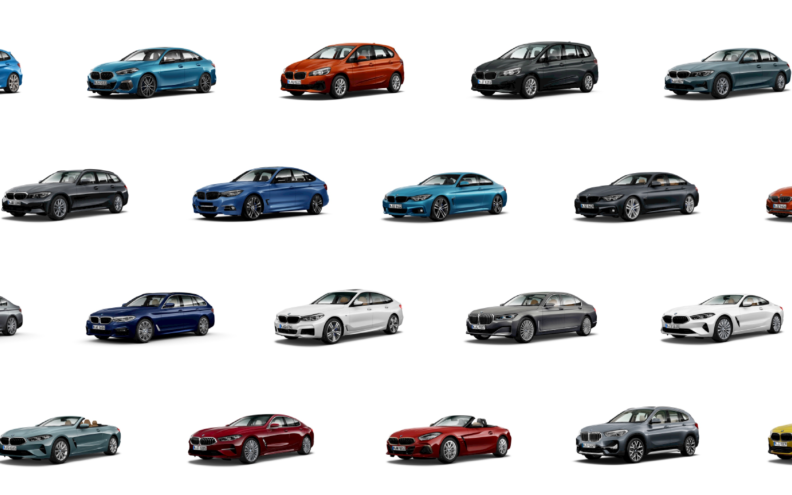
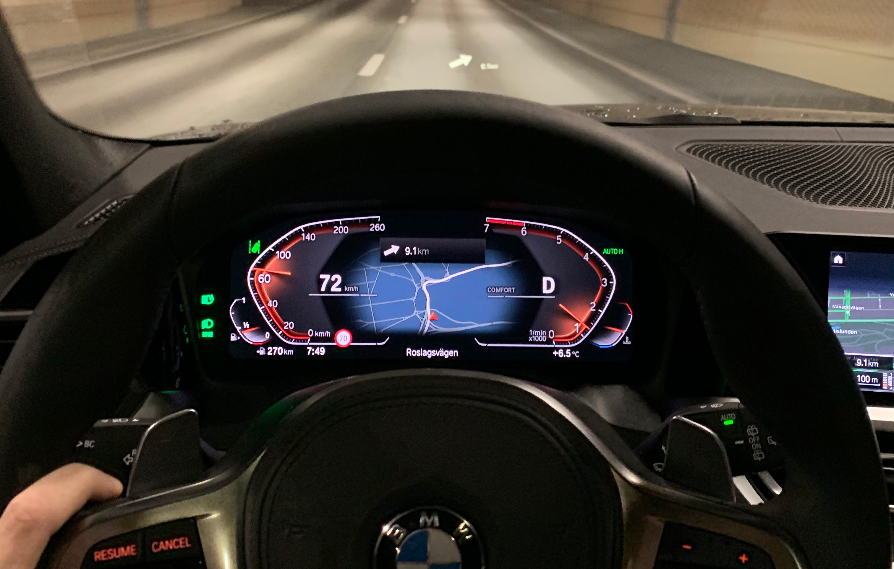
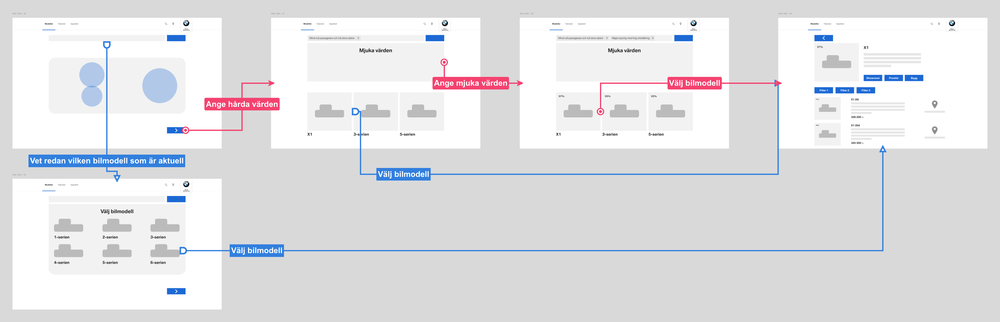
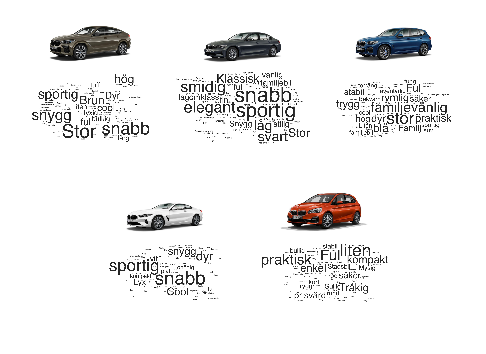
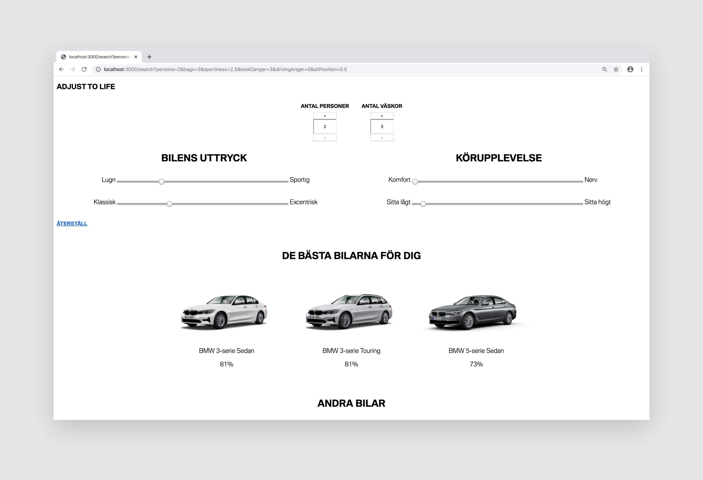

## A brand with a huge selection
Buying a BMW involves lots of individual choices. Not just choosing color or trim, but also what take on a model you want. Two similarly capable car models can have very different expressions. Therefore we started out bold: there is a BMW for almost any personality.

## A fully responsive experience
Finding your desired car means finding a car with the right capabilities, the right appearance and within the right budget. We set out to make a tool where these criteria could be altered whilst viewing the matching model selection. Through this, the user learns about the offering without having to go through a survey.

## How do you give attributes to a BMW?
The tool relies heavily on matching the attributes the user provides and the attributes the BMWs have. In order to find attributes for BMWs, we made multiple visits to BMW dealers and drove various of car models to get a first hand experience. We then went to the streets to find out what attributes people give the cars. This research boiled down to three adjective pairs. If it was hard to find opposite adjectives where both are experienced positive and both describe attributes for BMWs? Yes.

## Prototype thinking
The idea was set, but how were we going to proceed to validation? This is a rather new tool with no real predecessor in the car industry. Building early prototypes for testing was therefore crucial. The first prototype was a really crude tool only made to test our idea on matching car models on given values in real time.

## Releasing and validating
The first week, we got numerous interested car buyers to send in booking requests, and even sold cars. A couple of months after release, all BMW dealers are eager to put their cars into our stock car listing tool, knowing its worth. They get multiple leads daily from the tool, and at least weekly a car is sold with our stock car listing tool as first customer touchpoint. The refinement of the tool is now down to A/B testing with a growth mindset.

## Launch it with a film
To spread the word within the organisation, we created a film telling our thoughts behind the sales tool. Did you spot me?

<iframe src="https://player.vimeo.com/video/434349125?title=0&byline=0&portrait=0" style="position:absolute;top:0;left:0;width:100%;height:100%;" frameborder="0" allow="autoplay; fullscreen" allowfullscreen></iframe>

