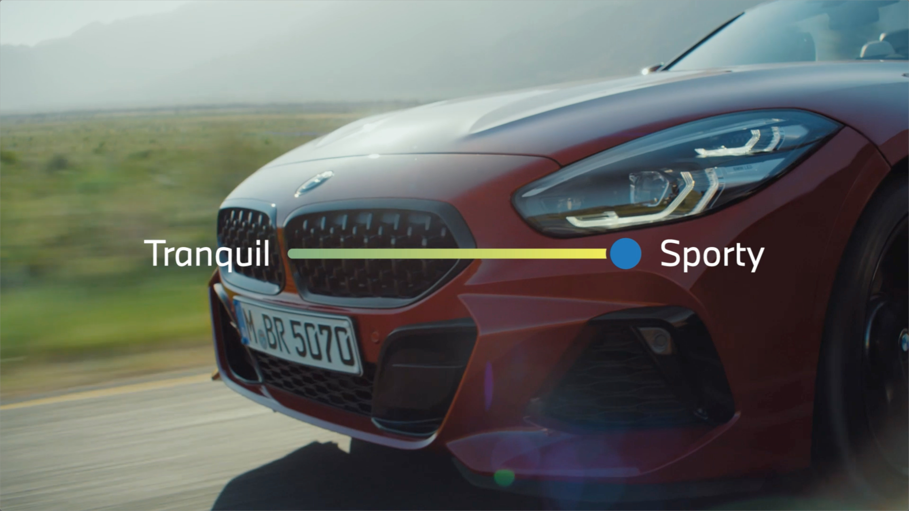
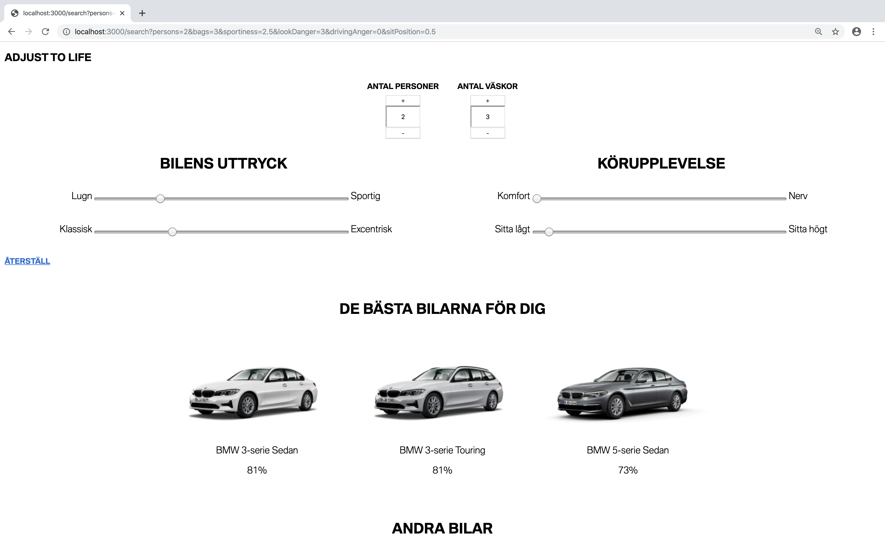
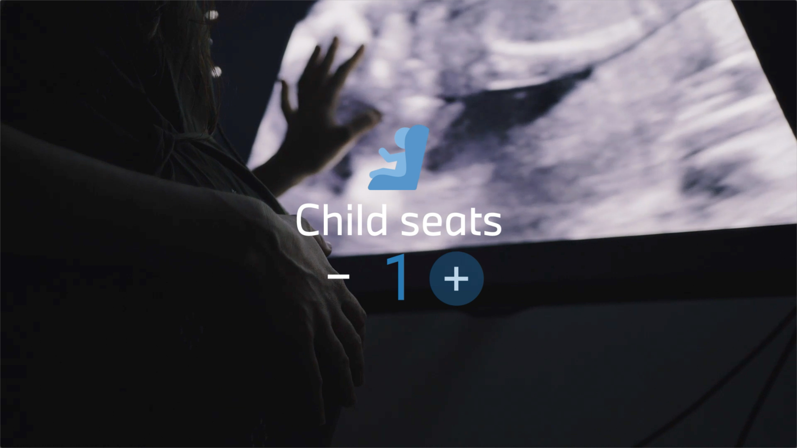
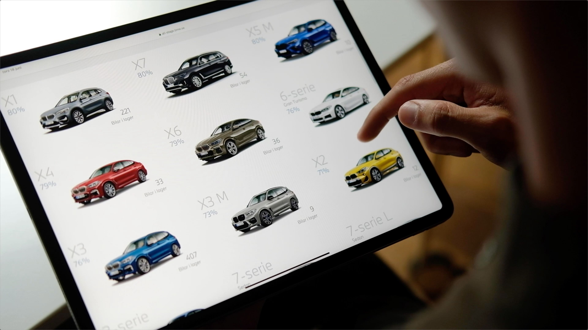

## A brand with a huge selection
Buying a BMW means making lots of choices. Not only the regular color and trim choices, but also what take on a model I want. Two similarly capable car models can have different expressions. Therefore we started out bold, there is a BMW for almost any personality.

## A fully responsive experience
Finding you desired car means finding a car with the right capabilities, the right appearance and within the right budget. We set out to make a tool where these criteria could be changed whilst viewing the matching model selection. Doing this, the user learns about the offering without having to go through a survey.

## How do you give attributes to a BMW?
This tool relies heavily on matching between the attributes the user provides and the attributes the BMWs have. In order to find attributes for BMWs, we spent multiple visits at BMW dealers, driving lots of different models to get a first hand experience. We then went to the streets to find out what attributes people give the cars. This research boiled down to three adjective pairs. If it was hard to find opposite adjectives where both are experienced positive and both describe attributes for BMWs? Yes.

## Prototype thinking
The idea was set, but how do we proceed to validation? It is a rather new tool with no real predecessor in the car industry. Building early prototypes for testing was therefore vital. The first prototype was a really crude tool where the user in real time could see which BMW reflected the given values.

<iframe src="https://player.vimeo.com/video/434349125?title=0&byline=0&portrait=0" style="position:absolute;top:0;left:0;width:100%;height:100%;" frameborder="0" allow="autoplay; fullscreen" allowfullscreen></iframe>

