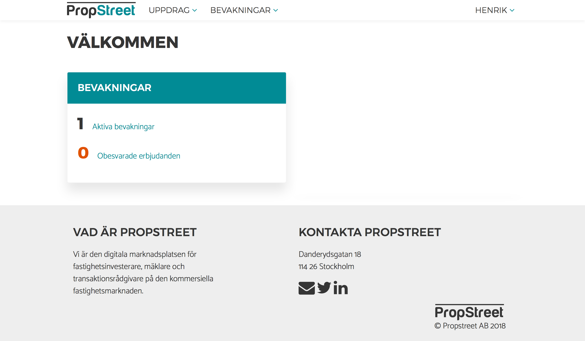
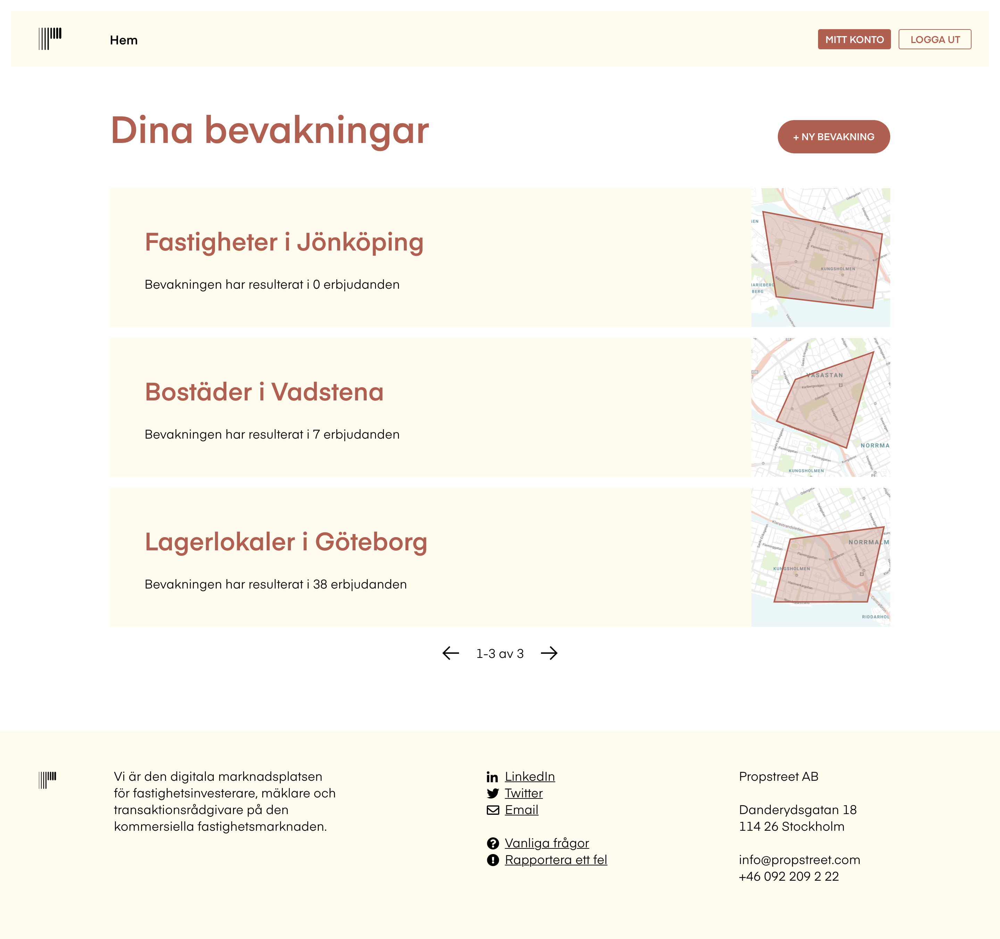
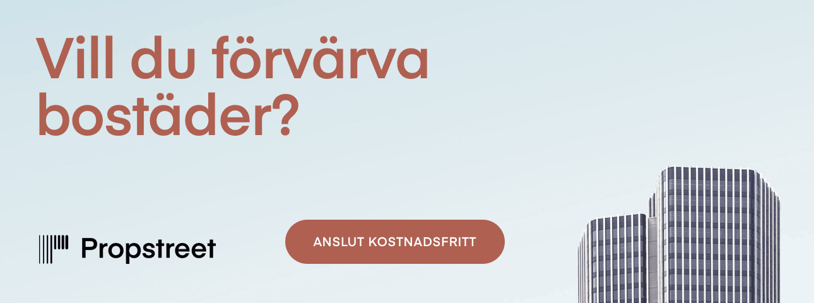

## From Cannes to www
Commercial real estate transactions are today mostly made between people who have met each other earlier. Often in these transactions, details are sensitive and brokers want to know that the investors they have contact with have real investing interests. Until today the solution has been analogue meetings to ensure trust, where one of the more popular is an event in Cannes. Propstreet introduces a digital marketplace that respects the rules of confidentiality in commercial real estate transactions and gives brokers new contacts.

## Developing feasible, user-oriented functions
User data was collected both by interviews and through user feedback. On the base of this, new functionality was developed together with the Propstreet team. Ideation sessions where I built wireframes on both paper and digital were held iteratively during two weeks. Feedback was implemented on wireframes and new versions were built. A close dialogue with the development team was held to ensure feasibility.

## Providing system understanding

There are few comparable services to Propstreet since it is something between a marketplace and a social network. This sets special demands on how the system understanding is communicated to the user. A new logged in landing page was created to convey how the system works. An onboarding was created in two versions, one for brokers and one for investors.

