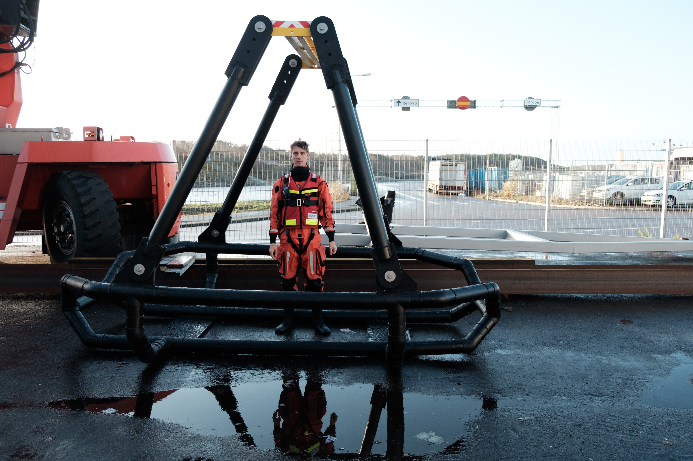

Är jag rätt?
After the Bachelor's thesis, I asked for more employment at the Swedish Sea Rescue Society. They are right now prototyping a new rescue jetski for big passenger ferries which I am designing and constructing the lift cradle for.

## The Base for Design
The Swedish Sea Rescue Society have developed a jetski that is called Rescuerunner. This jetski has been successfully used for shallow water rescue and rescue missions where quickness and agility is necessary. It is easily manoeuvred by one person and can handle very rough conditions. For this jetski, a lifting cradle was developed which you can drive into and then be quickly and safely be lifted. My challenge was to learn from the old cradles and design a new one for their newly developed jetski of a bigger size.

## Solving the Puzzle

SSRS
===

# Min första MD

Hallihallå

*kursiv* **fet**

* ett
* två