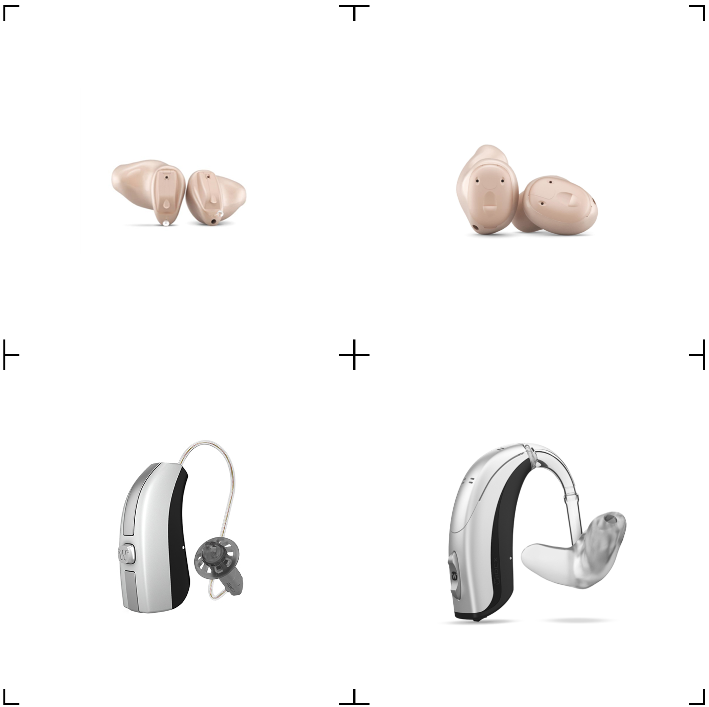
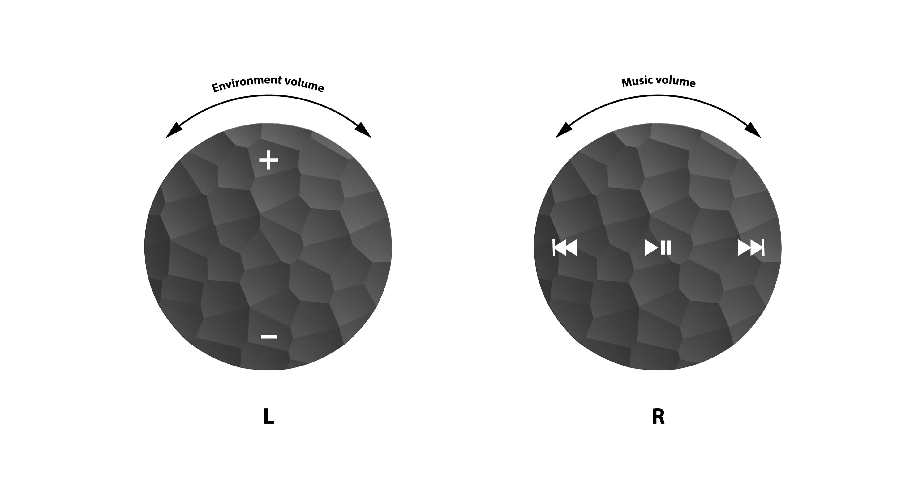
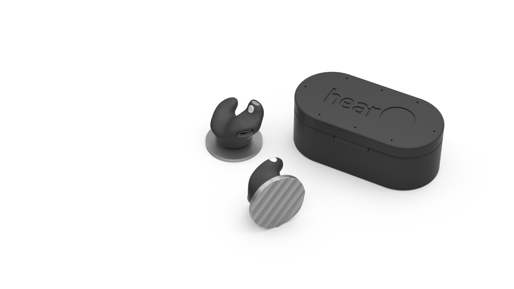
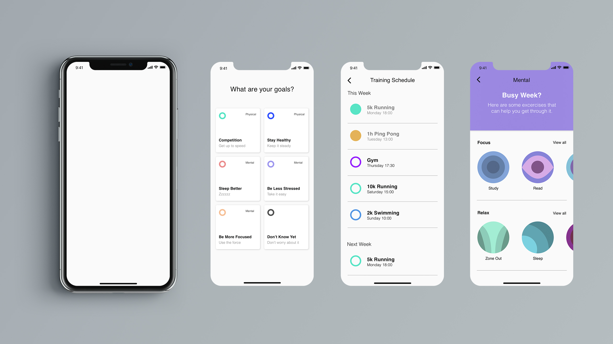
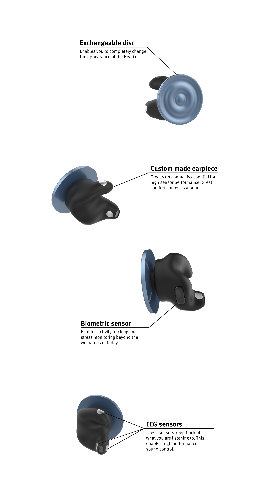
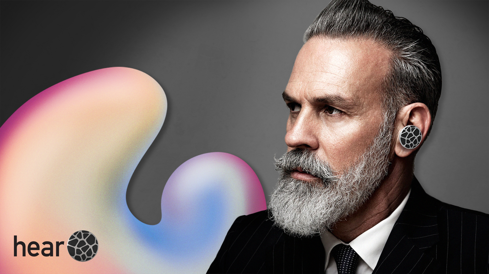
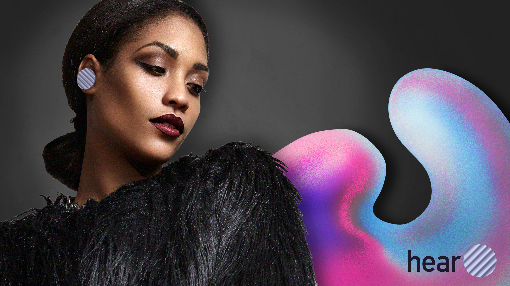

## What Can We Learn From Eyeglasses?
Untreated hearing loss can lead to social isolation, depression and even dementia. In Sweden up to 19% of the population live with hearing loss. It is therefore a widespread issue. How is it then that only 25% of the people suffering from hearing loss treat it?

We had a hypothesis: people with hearing loss experience stigma and therefore they do not want to reveal their impairment by wearing hearing aids. Our research showed that people feel old, handicapped and stupid when wearing hearing aids today. Hearing aids are embarrassing and people want to hide them. This was solid evidence on our hypothesis.

It is not the first time in history stigma has had so much power when it comes to impairments. Eyeglasses were just the same. Today however, they are a product with which people express their style with and are proud to wear. Could we bring the same difference to hearing aids?

## Visiting the Clinics
We paid visits to different audiologist clinics to see how hearing aids are acquired today. We were met with old interiors and a feeling of coming to a hospital which people described as negative. The audiologists showed us all the steps to receive hearing aids. One interesting finding was that all hearing aid companies seem to do just the same products. For most users the brands are impossible to differentiate. There are only six companies controlling 98% of the market.

<blockquote>
When I go to the disco to hit on girls I can't wear hearing aids. I want to be perceived as a healthy old man rather than elderly.
– Disco-loving hearing aid refuser

</blockquote>

## Understanding People's Motivations
To find empathy with people needing hearing aids, we did interviews with people experiencing hearing loss. We found it important to interview both users and non-users of hearing aids to know which struggles they both had. The diagnosis of hearing loss and the prescribed hearing aid was always seen as tough. We got examples of embarrassing situations when hearing loss crushed romantic moments. Users said that the worst experiences lie before the actual use. We also got to know the reason why everyone wants to hide their hearing aids: they just want to be like everyone else.

## The Need for a Radical New Solution
Just making the next generation hearing aid would probably not be enough to tackle the stigma, a radical new solution is needed. But how do you make a truly novel product that still builds on user research from the current state? We tackled this by finding out what people really get out of wearing hearing aids. It was all about interaction. Whether it is by speaking to friends or hearing noises in the outside world. We created a vision from this and formulated strategies to target more users.

## A Product That Everyone Wants
Stigmatization is about discrimination of a group of people with a specific set of characteristics. We found out that the most effective way to diminish stigma is to make a product that is used by everyone, not only those with hearing loss. This insight gave us the biggest challenge in this project: how do you create a product with a specific use but attractive to everyone? Lots of probing research through surveys and interviews with users and a co-creation session showed that we all have situations in which we want to hear better. This together with what we saw in the development of the headphone industry today led us in an interesting direction.

## We All Need a HearO
We created the HearO. It builds on three strategies to reach more users: easier access to the product, connection to style and integrating a function that everyone wants. The HearO is by that attractive to a broad user group, not only those with hearing loss. It has three key functions: express style, control the soundscape and increase wellbeing.

# REVEAL!!!

## Express Style
The HearO takes a bold approach on style expression. This product is made to express style and to make people feel proud of their product. The HearO makes this by exchangeable discs which totally change the complete appearance. There is a disc for everyone and every situation. They easily snap on and off.

## Control Your Soundscape
You can control your soundscape in many ways with the HearO. Music is controlled on the right HearO bud, adjusting the volume by turning the disc. The volume of the surrounding sound is controlled by rotating the left HearO bud. The same bud is also used to control the level of smart filtering, to filter out background noises and emphasize speech. This function is enabled by EEG sensors measuring your brain activity together with multiple microphones. Beamforming technology using a microphone array in the charging case enhances the noise filtering and can be used in noisy environments.

# FILM !!!

## Increase Your Wellbeing
The HearO increases your wellbeing by taking the health approach on wearables further. This is enabled by that the ear is the perfect placement for biometric measurements such as heart rate and stress level. The HearO gives you total control over your level of fitness and together with a smartphone app, you get a personalized training schedule. The stress level measurements is used in a part of the app focusing on giving you sound therapy for relaxation or focus.

## Developing a New Brand
The brand HearO was developed to get a great contrast to the hearing aid brands of today. It is a play with the words hear and hero. The dynamic logo where the O is replaced by the discs has been created to showcase the personalization possibilities. Posters were also created to show that the product fits both young and old, male and female.

## The HearO Brand Store
To get hearing aids today you go to an audiologist. They have outdated clinics with a strong healthcare association. We believe this needs to change to attract more users. Therefore we made a vision for a HearO brand store. It fits with how technology is sold today but with a stronger connection to style.

